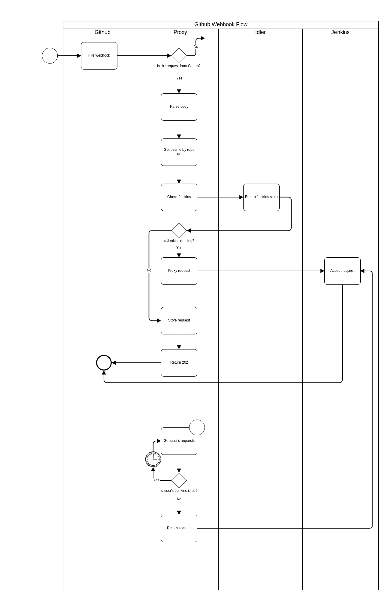
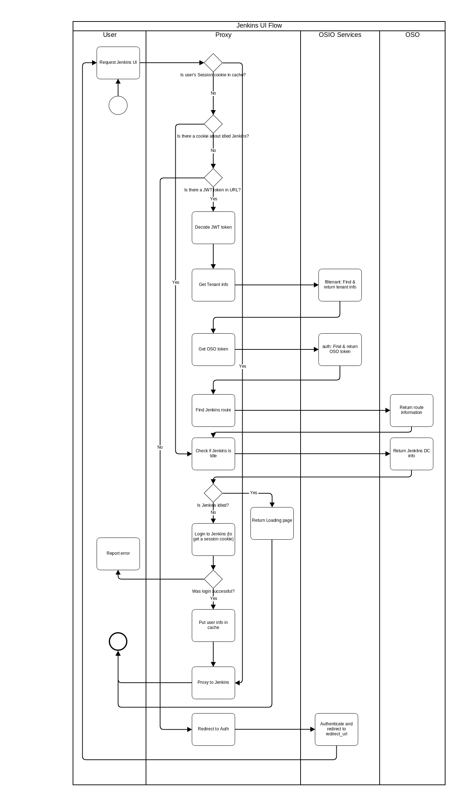

# fabric8-jenkins-proxy  

<!-- MarkdownTOC -->

- [What is it?](#what-is-it)
- [Data flow diagrams](#data-flow-diagrams)
- [How to build?](#how-to-build)
  - [Prerequisites](#prerequisites)
  - [Make usage](#make-usage)
    - [Compile the code](#compile-the-code)
    - [Build the container image](#build-the-container-image)
    - [Run the tests](#run-the-tests)
    - [Format the code](#format-the-code)
    - [Check commit message format](#check-commit-message-format)
    - [Clean up](#clean-up)
  - [Dependency management](#dependency-management)

<!-- /MarkdownTOC -->

# What is it?

fabric8-jenkins-proxy (Jenkins Proxy) is the sister project to [fabric8-jenkins-idler](https://github.com/fabric8-services/fabric8-jenkins-idler)(Jenkins Idler).
Its task is to run a HTTP Proxy which sits in between an [openshift.io](https://openshift.io) user and its Jenkins instance within [openshift.io](https://openshift.io).
For more information refer to the Idler [README](https://github.com/fabric8-services/fabric8-jenkins-idler/blob/master/README.md).

# Data flow diagrams

The following diagrams describe the data flow within the proxy for a received GitHub webhook respectively a direct user interaction with the Jenkins service:

# How to build?

The following paragraphs describe how to build and work with the source.

## Prerequisites

The project is written in [Go](https://golang.org/), so you will need a working Go installation (Go version >= 1.9.1).

The build itself is driven by GNU [Make](https://www.gnu.org/software/make/) which also needs to be installed on your systems.

Last but not least, you need a running Docker daemon, since the final build artifact is a Docker container.

## Make usage

### Compile the code

   $ make build

### Build the container image

   $ make image

### Run the tests

   $ make test

### Format the code

   $ make fmt

### Check commit message format

   $ make validate_commits

### Clean up

   $ make clean

More help is provided by `make help`.

## Dependency management

The dependencies of the project are managed by [Dep](https://github.com/golang/dep).
To add or change the current dependencies you need to delete the Dep lock file (_Gopkg.lock_), update the dependency list (_Gopkg.toml_) and then regenerate the lock file.
The process looks like this:

    $ make clean
    $ rm Gopkg.lock
    # Update Gopkg.toml with the changes to the dependencies
    $ make build
    $ git add Gopkg.toml Gopkg.lock
    $ git commit

